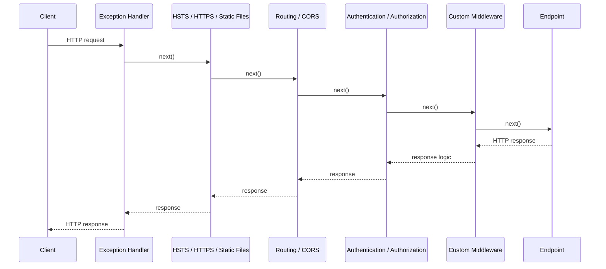

# ASP.NET Core Middleware

### Introduction to ASP.NET Core Middleware

ASP.NET Core Middleware ဆိုတာက ကျွန်တော်တို့ရဲ့ application မှာ ဝင်လာတဲ့ HTTP request တွေနဲ့ ထွက်သွားတဲ့ response တွေကို အဆင့်ဆင့် စီမံခန့်ခွဲပေးတဲ့ software component အစဉ်လိုက်ကို ခေါ်တာဖြစ်ပါတယ်. ဒါကို request processing pipeline လို့လည်း သိကြပါတယ်။ request တစ်ခု client ဆီကနေ ကျွန်တော်တို့ရဲ့ server ကို ရောက်လာတဲ့အခါ ဒီ middleware pipeline ကို ဖြတ်သန်းပြီးမှ သက်ဆိုင်ရာ endpoint ဆီကို ရောက်ရှိမှာ ဖြစ်ပါတယ်။

### Key Characteristics of Middleware

Middleware တွေမှာ အဓိကကျတဲ့ လက္ခဏာရပ်တွေ ရှိပါတယ်။

- **Modular and Reusable**
Middleware component တွေကို သီးသန့် တာဝန်တစ်ခုတည်းကို လုပ်ဆောင်ဖို့ ဒီဇိုင်းထုတ်ထားတဲ့အတွက် ကျွန်တော်တို့ရဲ့ application ရဲ့ မတူညီတဲ့ အစိတ်အပိုင်းတွေမှာဖြစ်စေ၊ တခြား project တွေမှာဖြစ်စေ အလွယ်တူ ပြန်လည်အသုံးပြုနိုင်ပါတယ်.
- **Request/Response Pipeline**
Middleware တွေက pipeline တစ်ခုလို အလုပ်လုပ်ပါတယ်။ component တစ်ခုချင်းစီက ဝင်လာတဲ့ request ကို စစ်ဆေးတာ၊ ပြင်ဆင်တာတွေ လုပ်ပြီးရင် နောက် component တစ်ခုဆီကို လက်ဆင့်ကမ်းပေးပါတယ်။ အပြန်အလှန်အားဖြင့် client ဆီကို ပြန်မယ့် response ကိုလည်း ဒီ pipeline ထဲမှာပဲ ပြန်လည်ကိုင်တွယ် လုပ်ဆောင်ပါတယ်.
- **Order Matters**
Middleware တွေကို pipeline ထဲမှာ ထည့်သွင်းတဲ့ **အစီအစဉ်** က အလွန်အရေးကြီးပါတယ်။ ဘာလို့လဲဆိုတော့ သူတို့အလုပ်လုပ်မယ့် အစဉ်လိုက်ကို ဒီအစီအစဉ်ကပဲ ဆုံးဖြတ်ပေးလို့ပါပဲ။ ဥပမာအားဖြင့်၊ Authentication middleware (သုံးစွဲသူက ဘယ်သူဘယ်ဝါဖြစ်ကြောင်း အတည်ပြုခြင်း) ကို Authorization middleware (သုံးစွဲသူရဲ့ လုပ်ဆောင်ခွင့်ကို စစ်ဆေးခြင်း) မတိုင်ခင်မှာ ထားရှိဖို့ လိုအပ်ပါတယ်.
- **Built-in and Custom**
ASP.NET Core မှာ static file တွေပြတာ၊ routing လုပ်တာ၊ authentication လုပ်တာလိုမျိုး အသုံးများတဲ့ functionality တွေအတွက် built-in middleware တွေ အများကြီး ပါဝင်ပြီးသားဖြစ်ပါတယ်။ လိုအပ်လာရင် ကျွန်တော်တို့ရဲ့ application အတွက် သီးသန့် custom middleware တွေကိုလည်း ကိုယ်တိုင် ဆောက်နိုင်ပါတယ်.
- **Request Short-Circuiting**
Middleware component တစ်ခုက pipeline ကို `short-circuit` လုပ်နိုင်ပါတယ်။ ဆိုလိုတာကတော့ သူက `next` delegate ကို မခေါ်တော့ဘဲ pipeline ရဲ့ နောက်အဆင့်ကို ဆက်မသွားစေဘဲ client ဆီကို response တန်းပြီး ပြန်ပို့လိုက်တာမျိုး ဖြစ်ပါတယ်.

### Examples of Common Middleware Functionalities

အသုံးများတဲ့ middleware လုပ်ဆောင်ချက်တွေရဲ့ ဥပမာတွေကတော့ အောက်ပါအတိုင်း ဖြစ်ပါတယ်.

- **Authentication and Authorization:** သုံးစွဲသူရဲ့ အထောက်အထားကို စစ်ဆေးပြီး resource တွေကို ဝင်ရောက်ခွင့်ကို ထိန်းချုပ်ပါတယ်.
- **Static Files:** HTML, CSS, JavaScript နဲ့ ပုံတွေလိုမျိုး static content တွေကို serve လုပ်ပေးပါတယ်.
- **Routing:** ဝင်လာတဲ့ URL တွေကို ကျွန်တော်တို့ရဲ့ သက်ဆိုင်ရာ Controller endpoint တွေဆီကို လမ်းကြောင်းညွှန်ပေးပါတယ်.
- **Error Handling:** Exception တွေကို ဖမ်းဆီးပြီး custom error page တွေ ပြသတာမျိုး လုပ်ဆောင်ပါတယ်.
- **Logging:** Request နဲ့ response တွေနဲ့ ပတ်သက်တဲ့ အချက်အလက် (Data) တွေကို မှတ်တမ်းတင်ပေးပါတယ်.
- **CORS (Cross-Origin Resource Sharing):** မတူညီတဲ့ domain တွေကနေ ကျွန်တော်တို့ရဲ့ application ကို ဝင်ရောက်သုံးစွဲခွင့်တွေကို စီမံခန့်ခွဲပေးပါတယ်.



### Implementing Custom Middleware

Custom middleware ကို အဓိက နည်းလမ်းနှစ်မျိုးနဲ့ ဆောက်နိုင်ပါတယ်.

### 1. Inline Middleware

`Program.cs` file ထဲမှာ `app.Use()` ဒါမှမဟုတ် `app.Run()` ကို တိုက်ရိုက်သုံးပြီး ရေးသားတဲ့နည်းလမ်း ဖြစ်ပါတယ်။ ဒါက ရိုးရှင်းတဲ့ middleware တွေအတွက် သင့်တော်ပါတယ်။ ဥပမာအနေနဲ့ အခုလို ရေးပြပါမယ်.

```csharp
app.Use(async (context, next) =>
{
    // Request မသွားခင် လုပ်ဆောင်မယ့် logic
    Console.WriteLine("Inline Middleware: Handling request.");

    await next.Invoke(); // နောက် middleware ကို ခေါ်ခြင်း

    // Response ပြန်လာပြီးမှ လုပ်ဆောင်မယ့် logic
    Console.WriteLine("Inline Middleware: Handling response.");
});
```

### 2. Middleware Class

ပိုပြီးရှုပ်ထွေးတဲ့ ဒါမှမဟုတ် ပြန်လည်အသုံးပြုချင်တဲ့ middleware တွေအတွက် သီးသန့် class တစ်ခု ဆောက်ပြီး ရေးသားတဲ့နည်းလမ်း ဖြစ်ပါတယ်။ ဒီနည်းလမ်းက ပိုပြီး စနစ်ကျသလို၊ ပိုကောင်းမွန်တဲ့ organization ကိုလည်း ပေးစွမ်းနိုင်ပါတယ်။ **နောက်ပိုင်းတွေမှာ** ကျွန်တော်တို့ရဲ့ project တွေမှာ ရှုပ်ထွေးတဲ့ logic တွေအတွက် ဒီနည်းလမ်းကို ပိုပြီး အသုံးပြုသွားမှာ ဖြစ်ပါတယ်။

**Middleware Class Sample**
ကျွန်တော်တို့ရဲ့ project မှာ `Middlewares` ဆိုတဲ့ Folder အသစ်တစ်ခု ဆောက်လိုက်ပါမယ်။ ပြီးရင် အဲ့ဒီ Folder ထဲမှာ `MyCustomMiddleware.cs` ဆိုတဲ့ class file အသစ်တစ်ခု ဆောက်ပြီး အောက်က code ကို ရေးပြပါမယ်။

```csharp
// Middlewares/MyCustomMiddleware.cs

public class MyCustomMiddleware
{
    private readonly RequestDelegate _next;

    public MyCustomMiddleware(RequestDelegate next)
    {
        _next = next;
    }

    public async Task InvokeAsync(HttpContext context)
    {
        // Request pipeline မှာ နောက်အဆင့်မသွားခင် custom logic တွေ ဒီမှာရေးလို့ရပါတယ်
        Console.WriteLine("Custom Middleware Class: Handling request.");

        // နောက် middleware component ကို ခေါ်လိုက်တာဖြစ်ပါတယ်
        await _next(context);

        // Response ပြန်လာပြီးနောက်မှာ custom logic တွေ ထပ်ရေးလို့ရပါတယ်
        Console.WriteLine("Custom Middleware Class: Handling response.");
    }
}
```

**Note:** `RequestDelegate` ဆိုတာက pipeline မှာ နောက်လာမယ့် middleware ကို ကိုယ်စားပြုတဲ့ delegate တစ်ခုဖြစ်ပါတယ်။ `InvokeAsync` method ကတော့ middleware တိုင်းမှာ အဓိက ပါဝင်ရမယ့် method ဖြစ်ပြီး `HttpContext` ကို parameter အနေနဲ့ လက်ခံရပါတယ်.

### Registering the Middleware Class

ကျွန်တော်တို့ ဆောက်ခဲ့တဲ့ `MyCustomMiddleware` class ကို application pipeline မှာ အသုံးပြုနိုင်ဖို့အတွက် `Program.cs` file မှာ register လုပ်ပေးဖို့ လိုအပ်ပါတယ်.

အောက်မှာ register လုပ်ပုံကို ရေးပြပါမယ်.

```csharp
// Program.cs

var builder = WebApplication.CreateBuilder(args);
var app = builder.Build();

// ... တခြား middleware တွေ

// ကျွန်တော်တို့ရဲ့ custom middleware ကို ဒီမှာ register လုပ်ပါမယ်
app.UseMiddleware<MyCustomMiddleware>();

// ... တခြား middleware တွေ

app.MapGet("/", () => "Hello World!");

app.Run();
```

`app.UseMiddleware<MyCustomMiddleware>();` ဆိုတဲ့ extension method ကို သုံးပြီး ကျွန်တော်တို့ရဲ့ class ကို pipeline ထဲကို ထည့်သွင်းပေးရမှာ ဖြစ်ပါတယ်။ ပြီးရင် ကျွန်တော်တို့ရဲ့ application ကို run တဲ့အခါ console မှာ request တစ်ခုချင်းစီအတွက် "Custom Middleware Class: Handling request." နဲ့ "Custom Middleware Class: Handling response." ဆိုတဲ့ log message တွေကို တွေ့ရမှာ ဖြစ်ပါတယ်.

### Real-World Example: Request Duration Logging

Production API တစ်ခုမှာ request တစ်ခုချင်းစီ ဘယ်လောက်ကြာသလဲဆိုတာ log ထားခြင်းက slow endpoint တွေကို ရှာဖွေရာမှာ အသုံးဝင်ပါတယ်။ `Program.cs` ထဲမှာ endpoint mapping မလုပ်ခင် အောက်ပါ middleware ကို ထည့်နိုင်ပါတယ်။

```csharp
using System.Diagnostics;

app.Use(async (context, next) =>
{
    var startedAt = Stopwatch.GetTimestamp();

    try
    {
        await next(context);
    }
    finally
    {
        app.Logger.LogInformation(
            "HTTP {Method} {Path} completed in {ElapsedMilliseconds:F1} ms",
            context.Request.Method,
            context.Request.Path,
            Stopwatch.GetElapsedTime(startedAt).TotalMilliseconds);
    }
});

app.MapControllers();
```

`finally` ကို သုံးထားတဲ့အတွက် endpoint က exception throw လုပ်ရင်တောင် request duration ကို log ထားနိုင်ပါတယ်။ ဒီ middleware ရဲ့ အောက်မှာ register လုပ်ထားတဲ့ endpoint တွေနဲ့ middleware တွေရဲ့ ကြာချိန်ကို တိုင်းတာပေးမှာ ဖြစ်ပါတယ်။

### Real-World Example: Safe Request and Response Data Logging

Request/response body တစ်ခုလုံးကို log လုပ်ရင် password, token, cookie, payment data နဲ့ PII တွေ မတော်တဆ ပါသွားနိုင်ပါတယ်။ ဒါကြောင့် sensitive field တွေကို နာမည်နဲ့ လိုက်ဖယ်မယ့် blacklist ထက် log လုပ်ခွင့်ပြုထားတဲ့ field တွေကိုပဲ ရွေးထည့်တဲ့ allowlist ပုံစံကို သုံးပါမယ်။

```csharp
using System.Text.Json;

var builder = WebApplication.CreateBuilder(args);
var app = builder.Build();

const string SafeRequestLog = "SafeRequestLog";
const string SafeResponseLog = "SafeResponseLog";

app.Use(async (context, next) =>
{
    context.Response.OnCompleted(() =>
    {
        context.Items.TryGetValue(SafeRequestLog, out var requestData);
        context.Items.TryGetValue(SafeResponseLog, out var responseData);

        app.Logger.LogInformation(
            "HTTP {Method} {Endpoint} returned {StatusCode}; RequestData={RequestData}; ResponseData={ResponseData}",
            context.Request.Method,
            context.GetEndpoint()?.DisplayName ?? "unmatched",
            context.Response.StatusCode,
            JsonSerializer.Serialize(requestData),
            JsonSerializer.Serialize(responseData));

        return Task.CompletedTask;
    });

    await next(context);
});

app.MapPost("/orders", (CreateOrderRequest request, HttpContext context) =>
{
    context.Items[SafeRequestLog] = new
    {
        request.ProductId,
        request.Quantity
    };

    var response = new OrderCreatedResponse(Guid.NewGuid(), "Pending");

    context.Items[SafeResponseLog] = new
    {
        response.OrderId,
        response.Status
    };

    return Results.Created($"/orders/{response.OrderId}", response);
});

app.Run();

public sealed record CreateOrderRequest(
    string ProductId,
    int Quantity,
    string CustomerEmail,
    string PaymentToken);

public sealed record OrderCreatedResponse(Guid OrderId, string Status);
```

ဒီ example မှာ request ထဲက `ProductId`, `Quantity` နဲ့ response ထဲက `OrderId`, `Status` ကိုပဲ log လုပ်ပါတယ်။ `CustomerEmail`, `PaymentToken`, request/response body အပြည့်အစုံ, query string, `Authorization` header နဲ့ cookies တွေကို log မလုပ်ပါဘူး။ Field အသစ်တိုးလာရင် safe ဖြစ်ကြောင်း review လုပ်ပြီးမှ allowlist object ထဲကို ထည့်သင့်ပါတယ်။
