# Junior .NET Developer Roadmap

Follow the roadmap from top to bottom. Build a small project at each project milestone before moving on.

```mermaid
flowchart TD
    START([Start]) --> FOUNDATION["1. Developer Foundations<br/>Command line · Git · GitHub<br/>Problem solving · Debugging"]
    FOUNDATION --> CSHARP["2. C# Fundamentals<br/>Types · Control flow · Methods<br/>Collections · Exceptions · LINQ"]
    CSHARP --> OOP["3. Object-Oriented C#<br/>Classes · Interfaces · Generics<br/>SOLID basics · Async/await"]
    OOP --> PROJECT1["Project: Console Application"]

    PROJECT1 --> DATABASE["4. Databases and SQL<br/>Tables · Relationships · Joins<br/>CRUD · Transactions"]
    DATABASE --> DATA["5. Data Access in .NET<br/>ADO.NET → Dapper → EF Core<br/>Migrations · LINQ queries"]
    DATA --> PROJECT2["Project: Data-Driven Console App"]

    PROJECT2 --> WEB["6. Web Fundamentals<br/>HTTP · REST · JSON<br/>HTML · CSS · JavaScript basics"]
    WEB --> ASPNET["7. ASP.NET Core<br/>Dependency injection · Configuration<br/>Middleware · Logging"]
    ASPNET --> TRACK{"Choose a starting track"}
    TRACK --> API["Web API<br/>Controllers · Validation · OpenAPI"]
    TRACK --> MVC["MVC<br/>Controllers · Views · Forms"]
    API --> PROJECT3["Project: CRUD Web Application"]
    MVC --> PROJECT3

    PROJECT3 --> SECURITY["8. Security<br/>Authentication · Authorization<br/>Cookies/JWT · RBAC · HTTPS"]
    SECURITY --> QUALITY["9. Production Basics<br/>Testing · Error handling · Logging<br/>Git workflow · Clean architecture basics"]
    QUALITY --> OPTIONAL{"Choose as needed"}
    OPTIONAL --> REALTIME["SignalR and Real-Time Features"]
    OPTIONAL --> CHARTS["Charts and Visualization"]
    REALTIME --> DEPLOY["10. Deployment<br/>Publish · IIS · Environment config"]
    CHARTS --> DEPLOY
    DEPLOY --> READY([Junior .NET Developer])

    classDef milestone fill:#512bd4,color:#fff,stroke:#351c75,stroke-width:2px;
    class PROJECT1,PROJECT2,PROJECT3,READY milestone;
```

## Learning Resources

## 🗄️ Console App + Database (ADO.NET / Dapper / EF Core)

- [Using .NET 8 Console App to Connect to SQL Server with Microsoft.Data.SqlClient](https://github.com/sannlynnhtun-coding/dotnet-developer-roadmap/blob/main/Using%20a%20.NET%208%20Console%20Application%20to%20Connect%20to%20SQL%20Server%20with%20Microsoft.Data.SqlClient.md)
- [Using .NET 8 Console App with Dapper](https://github.com/sannlynnhtun-coding/dotnet-developer-roadmap/blob/main/Using%20a%20.NET%208%20Console%20Application%20to%20Connect%20to%20SQL%20Server%20with%20Dapper.md)
- [Using .NET 8 Console App with EF Core](https://github.com/sannlynnhtun-coding/dotnet-developer-roadmap/blob/main/Using%20a%20.NET%208%20Console%20Application%20to%20Connect%20to%20SQL%20Server%20with%20EFCore.md)
- [Benefits of a Separate EF Core Database Library](https://github.com/sannlynnhtun-coding/dotnet-developer-roadmap/blob/main/Benefits%20of%20a%20Separate%20EF%20Core%20Database%20Library.md)

## 🖥️ Fundamentals

- [Class Library](https://github.com/sannlynnhtun-coding/dotnet-developer-roadmap/blob/main/Class%20Library.md)
- [Understanding Async/Await in C# Console Applications](https://github.com/sannlynnhtun-coding/dotnet-developer-roadmap/blob/main/Understanding%20Async%20Await%20in%20C%23%20Console%20Applications.md)
- [N-Layered Architecture](https://github.com/sannlynnhtun-coding/dotnet-developer-roadmap/blob/main/N-Layered%20Architecture.md)
- [Implementing N-Layered Architecture in C# Console Applications](https://github.com/sannlynnhtun-coding/dotnet-developer-roadmap/blob/main/Implementing%20N-Layered%20Architecture%20in%20C%23%20Console%20Applications.md)

## 🌐 ASP.NET Core Web API

- [Using ADO.NET in ASP.NET Core Web API](https://github.com/sannlynnhtun-coding/dotnet-developer-roadmap/blob/main/Using%20ADO.NET%20in%20ASP.NET%20Core%20Web%20API.md)
- [Using Dapper in ASP.NET Core Web API](https://github.com/sannlynnhtun-coding/dotnet-developer-roadmap/blob/main/Using%20Dapper%20in%20ASP.NET%20Core%20Web%20API.md)
- [Using EF Core (DB First) in ASP.NET Core Web API](https://github.com/sannlynnhtun-coding/dotnet-developer-roadmap/blob/main/Using%20EFCore%20in%20ASP.NET%20Core%20Web%20API.md)
- [Result Pattern](https://github.com/sannlynnhtun-coding/dotnet-developer-roadmap/blob/main/Result%20Pattern.md)

## 🏛️ ASP.NET Core MVC (Submit / AJAX)

- [CRUD with EF Core Database First (Submit)](https://github.com/sannlynnhtun-coding/dotnet-developer-roadmap/blob/main/CRUD%20with%20EF%20Core%20Database%20First%20(Submit).md)
- [CRUD with EF Core Database First (jQuery AJAX)](https://github.com/sannlynnhtun-coding/dotnet-developer-roadmap/blob/main/CRUD%20with%20EF%20Core%20Database%20First%20(jQuery%20AJAX).md)
- [Data Passing Techniques in ASP.NET Core MVC](https://github.com/sannlynnhtun-coding/dotnet-developer-roadmap/blob/main/Data%20Passing%20Techniques%20in%20ASP.NET%20Core%20MVC.md)
- [Integrating AdminLTE v3](https://github.com/sannlynnhtun-coding/dotnet-developer-roadmap/blob/main/Integrating%20AdminLTE%20v3.md)

## 📊 Charts & Visualization

- [ApexCharts & HighCharts in ASP.NET Core MVC](https://github.com/sannlynnhtun-coding/dotnet-developer-roadmap/blob/main/ApexCharts%20&%20HighCharts%20in%20ASP.NET%20Core%20MVC.md)

## 📡 SignalR & Real-time Features

- [Real-Time Chat App](https://github.com/sannlynnhtun-coding/junior-dotnet-developer-roadmap/blob/main/Build%20a%20Real-Time%20Chat%20App.md)
- [Realtime Notification System](https://github.com/sannlynnhtun-coding/dotnet-developer-roadmap/blob/main/Realtime%20Notification%20System.md)

## 🛠️ Middleware & Logging

- [ASP.NET Core Middleware](https://github.com/sannlynnhtun-coding/dotnet-developer-roadmap/blob/main/ASP.NET%20Core%20Middleware.md)
- [Introduction to Logging](https://github.com/sannlynnhtun-coding/dotnet-developer-roadmap/blob/main/Introduction%20to%20Logging.md)
- [ASP.NET Core Logging with Serilog](https://github.com/sannlynnhtun-coding/dotnet-developer-roadmap/blob/main/ASP.NET%20Core%20Logging%20with%20Serilog.md)

## 🔐 Authentication & Authorization

- [ASP.NET Core Cookie Authentication](https://github.com/sannlynnhtun-coding/dotnet-developer-roadmap/blob/main/ASP.NET%20Core%20Cookie%20Authentication.md)
- [Role-Based Access Control (RBAC)](https://github.com/sannlynnhtun-coding/dotnet-developer-roadmap/blob/main/RBAC.md)
- [Static RBAC](https://github.com/sannlynnhtun-coding/dotnet-developer-roadmap/blob/main/Static%20RBAC.md)
- [Dynamic RBAC](https://github.com/sannlynnhtun-coding/dotnet-developer-roadmap/blob/main/Dynamic%20RBAC.md)

## ☁ Deploy

- [Deploying ASP.NET Core Core Web Applications on IIS](https://github.com/sannlynnhtun-coding/dotnet-developer-roadmap/blob/main/Deploy-On-IIS.md)
